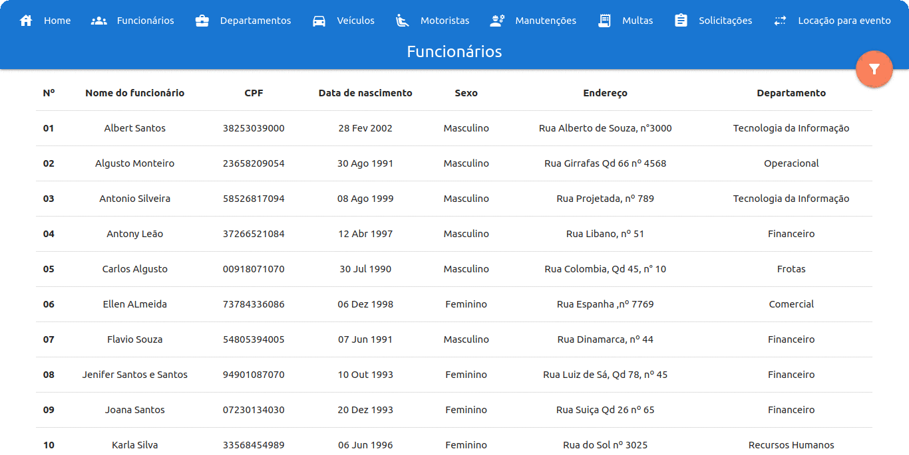
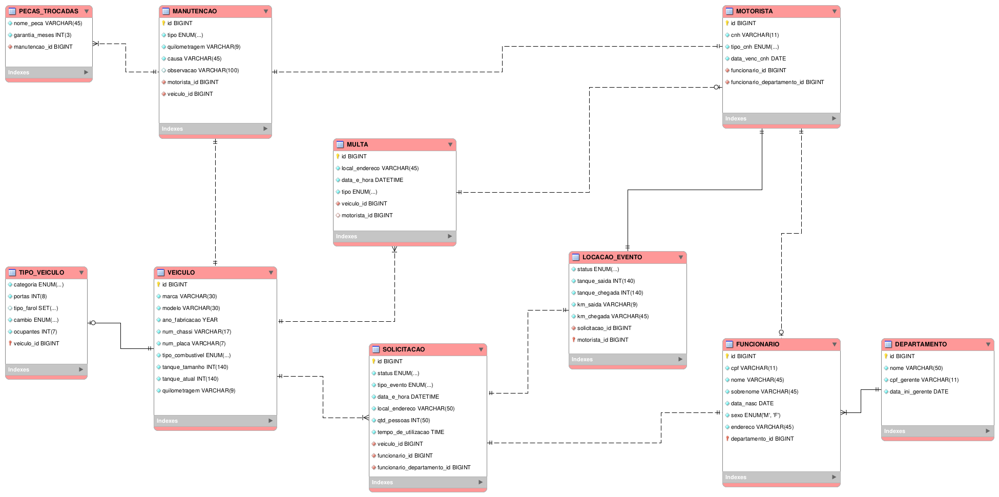

<h5 align="center">

## Projeto desenvolvido por Erick Rodrigues:

`Banco de dados`, `Lab. de Banco de Dados` & `Temas Tecnológicos em Infraestrutura Tecnologica`

</h5>

<h4 id="topo" align="center"> 
	<a href="#1">
     Estudo 
	</a> 
	&ensp;|&ensp;
	<a href="#2">
		Criação do BD
	</a>
	&ensp;|&ensp;
	<a href="#3">
		Inserção de dados no BD
	</a>
</h4>

 

## tecnologias usadas:

    
    
    
    

<h5 align="center"></h5>
 

<a href="#topo">
  <h2 id="1">

>  ### **Estudo: `Controle de frotas`**

  </h2>
</a>

---

Uma empresa de médio porte possui um quadro com 45 funcionários e uma frota de carros para uso estritamente voltado à atividade profissional. Contudo, o departamento de frotas, responsável pelos carros, realiza um controle manual do uso desses carros. 

> Criação do sistema para melhor controle

- [x] Existem três tipos de carros na frota, que são: ​Hatch​, ​Sedan e ​Pick-up​. Todos os carros estão ligados ao departamento de frota.

- [x] Em todos os tipos de carro é necessário guardar a marca, modelo, ano, número de chassi, placa e tipo de combustível.

- [x] Também devem ser armazenados os opcionais de cada carro. Por exemplo,
  quantidade de portas, farol de neblina, câmbio automático, etc. O Ricardo
  ressaltou que esses opcionais podem mudar com o tempo.

- [x] Os carros são utilizados para alguns tipos de eventos, como viagens, reuniões externas e visitas técnicas.

- [x] Apenas os funcionários da empresa podem solicitar os carros e somente um por solicitação. Nesse momento, é necessário informar qual é a finalidade do pedido, a quantidade de pessoas, data e hora de utilização, local e tempo que o carro será usado, além da matrícula dos funcionários que utilizarão o carro e o departamento de cada um.

- [x] Para cada solicitação, deve ser armazenado a quilometragem do início e do fim do atendimento.

- [x] Os carros são dirigidos exclusivamente pelos motoristas do departamento de frota. O banco de dados deve guardar o número de CNH, tipo de habilitação e a data do vencimento da carteira.

- [x] Todos os carros podem ter manutenções preventivas e corretivas. Em cada
manutenção, deve ser armazenado o tipo de manutenção, a quilometragem, a
causa, o motorista que levou o carro e outras possíveis observações. Além
disso, é necessário registrar todas as peças trocadas e o tempo de garantiade cada uma.

- [x] Também é necessário armazenar possíveis multas vinculadas a cada carro.
Para cada multa, deve ser informado o local, a data e hora, o tipo da multa e o motorista que estava utilizando o carro, caso tenha sido identificado.

- [x] O departamento precisa ter um estoque de combustível, que deve armazenar a  quantidade de combustível utilizado por cada carro, em cada evento.

 

---

<a href="#topo">

### **Diagrama de Entidade Relacional**

</a>

---

#### **SQL**

<a href="#topo">
  <h4 id="2">

  >Criação do banco de dados no postgresql

  </h4>
</a>

~~~sql
BEGIN;

-- Criando um tipo enumerado referente aos tipos de combustíveis existentes
CREATE TYPE tipos_de_combustiveis AS ENUM('Gasolina', 'Etanol', 'Diesel', 'Álcool', 'GNV');

-- Criando a tabela veiculo
CREATE TABLE IF NOT EXISTS veiculo (
  id BIGSERIAL,
  marca VARCHAR(30) NOT NULL,
  modelo VARCHAR(30) NOT NULL,
  ano_fabricacao VARCHAR(4) NOT NULL,
  num_chassi VARCHAR(17) NOT NULL UNIQUE,
  num_placa VARCHAR(7) NOT NULL UNIQUE,
  tipo_combustivel tipos_de_combustiveis NOT NULL,
  tanque_tamanho INT CHECK(tanque_tamanho >= 5 AND tanque_tamanho <= 140) NOT NULL,
  tanque_atual INT CHECK(tanque_atual >= 0 AND tanque_atual <= 140)NOT NULL,
  quilometragem VARCHAR(9) NOT NULL,
  PRIMARY KEY (id)
);

-- Criando tipos enumerados
CREATE TYPE tipos_de_carros	 AS ENUM('Hatch', 'Sedan', 'Pickup', 'SUV');
CREATE TYPE	tipos_de_farois	 AS ENUM('Principal', 'Milha', 'Neblina', 'Auxiliar');
CREATE TYPE	tipos_de_cambios AS ENUM('Manual', 'Automático', 'Sequencial', 'CVT');

-- Criando uma tabela referente aos tipos de veículos
CREATE TABLE IF NOT EXISTS tipo_veiculo (
  categoria tipos_de_carros NOT NULL,
  portas INT NOT NULL CHECK(portas >= 0 AND portas <= 5) ,
  tipo_farol tipos_de_farois NOT NULL DEFAULT 'Principal',
  cambio tipos_de_cambios NOT NULL,
  ocupantes INT NOT NULL CHECK(ocupantes >= 0 AND ocupantes <= 8) DEFAULT '5',
  veiculo_id BIGINT NOT NULL,
  PRIMARY KEY (veiculo_id),
  CONSTRAINT fk_tipo_veiculo_veiculo_id
    FOREIGN KEY (veiculo_id)
  	REFERENCES veiculo (id)
      ON DELETE CASCADE
      ON UPDATE CASCADE
);

--Criando uma tabela referente aos departamentos existentes
CREATE TABLE IF NOT EXISTS departamento (
  id BIGSERIAL,
  dnome VARCHAR(50),
  cpf_gerente VARCHAR(11) UNIQUE,
  data_ini_gerente DATE,
  PRIMARY KEY (id)
);

-- Criando um tipo enumerado referente aos tipos de sexo
CREATE TYPE tipos_de_sexo AS ENUM('Masculino', 'Feminino', 'Outro');

-- Criando uma tabela referente aos funcionários
CREATE TABLE IF NOT EXISTS funcionario (
  id BIGSERIAL,
  cpf VARCHAR(11) NOT NULL UNIQUE,
  nome VARCHAR(45) NOT NULL,
  sobrenome VARCHAR(45) NOT NULL,
  data_nasc DATE NOT NULL,
  sexo tipos_de_sexo NOT NULL,
  endereco VARCHAR(45) NOT NULL,
  departamento_id BIGINT NOT NULL,
  PRIMARY KEY (id, departamento_id),
  FOREIGN KEY (departamento_id)
    REFERENCES departamento (id)
);

-- Criando um tipo enumerado referente aos tipos de eventos aceitos na empresa
CREATE TYPE tipos_de_eventos AS ENUM('Viagem', 'Reunião Externa', 'Visita Técnica');
-- Criando um tipo enumerado referente aos status
CREATE TYPE tipo_de_status AS ENUM('aberto', 'fechado');

-- Criando a tabela solicitação
CREATE TABLE IF NOT EXISTS solicitacao (
  id BIGSERIAL,
  status tipo_de_status DEFAULT 'aberto',
  tipo_evento tipos_de_eventos NOT NULL,
  data_e_hora TIMESTAMP NOT NULL,
  local_endereco VARCHAR(50) NOT NULL,
  qtd_pessoas INT NOT NULL CHECK(qtd_pessoas >= 0 AND qtd_pessoas <= 50),
  tempo_de_utilizacao TIME NOT NULL,
  veiculo_id BIGINT NOT NULL,
  funcionario_id BIGINT NOT NULL,
  funcionario_departamento_id BIGINT NOT NULL,
  PRIMARY KEY (id),
  CONSTRAINT fk_solicitacao_veiculo_id
    FOREIGN KEY (veiculo_id)
    REFERENCES veiculo (id)
      ON DELETE CASCADE
      ON UPDATE CASCADE,
  CONSTRAINT fk_solicitacao_funcionario_id
    FOREIGN KEY (funcionario_id , funcionario_departamento_id)
    REFERENCES funcionario (id , departamento_id)
      ON DELETE CASCADE
      ON UPDATE CASCADE
);

-- Criando tipo enumerado referente as categorias de cnh
CREATE TYPE categorias_cnh AS ENUM('A', 'B', 'C', 'D', 'E');

-- Criando uma tabela referente ao motorista
CREATE TABLE IF NOT EXISTS motorista (
  id BIGSERIAL ,
  cnh VARCHAR(11) NOT NULL DEFAULT 'Não possui CNH',
  tipo_cnh categorias_cnh NOT NULL,
  data_venc_cnh DATE NOT NULL,
  funcionario_id BIGINT NOT NULL,
  funcionario_departamento_id BIGINT NOT NULL,
  PRIMARY KEY (id),
  CONSTRAINT fk_motorista_funcionario_id
    FOREIGN KEY (funcionario_id , funcionario_departamento_id)
    REFERENCES funcionario (id , departamento_id)
      ON DELETE CASCADE
      ON UPDATE CASCADE
);

-- Criando a tabela locação 
CREATE TABLE IF NOT EXISTS locacao_evento (
  status_locacao tipo_de_status NOT NULL DEFAULT 'aberto',
  tanque_saida INT CHECK(tanque_saida > 0 AND tanque_saida <= 140) NOT NULL,
  tanque_chegada INT CHECK(tanque_chegada > 0 AND tanque_chegada <= 140) NOT NULL,
  km_saida VARCHAR(9) NOT NULL,
  km_chegada VARCHAR(45) NOT NULL DEFAULT '0',
  solicitacao_id BIGINT NOT NULL,
	motorista_id BIGINT NOT NULL,
  PRIMARY KEY (solicitacao_id, motorista_id),
  CONSTRAINT fk_locacao_solicitacao_id
    FOREIGN KEY (solicitacao_id)
  	REFERENCES solicitacao (id)
      ON DELETE CASCADE
      ON UPDATE CASCADE,
	FOREIGN KEY (motorista_id)
	REFERENCES motorista(id)	
);

-- Criando um tipo enumerado referente aos tipos de manutenção na empresa
CREATE TYPE tipos_de_manutencao AS ENUM('Preventiva', 'Corretiva');

-- Criando uma tabela referente a manutenção do veiculo 
CREATE TABLE IF NOT EXISTS manutencao (
  id BIGSERIAL,
  tipo tipos_de_manutencao NOT NULL,
  quilometragem VARCHAR(9) NOT NULL,
  causa VARCHAR(45) NOT NULL,
  observacao VARCHAR(200) DEFAULT 'Sem observação',
  motorista_id BIGINT NOT NULL,
  veiculo_id BIGINT NOT NULL,
  PRIMARY KEY (id),
  CONSTRAINT fk_manutencao_veiculo_id
    FOREIGN KEY (veiculo_id)
    REFERENCES veiculo (id)
      ON DELETE CASCADE
      ON UPDATE CASCADE,
  FOREIGN KEY (motorista_id)
    REFERENCES motorista (id)
);

-- Criando uma tabela referente as peças trocadas na manutenção
CREATE TABLE IF NOT EXISTS pecas_trocadas (
  nome_peca VARCHAR(45) NOT NULL,
  garantia_meses INT CHECK(garantia_meses > 0) NOT NULL,
  manutencao_id BIGINT NOT NULL,
  CONSTRAINT fk_pecas_manutencao_id
    FOREIGN KEY (manutencao_id)
    REFERENCES manutencao (id)
     ON DELETE CASCADE
     ON UPDATE CASCADE
);

-- Criando um tipo enumerado referente aos tipos de multas existentes
CREATE TYPE tipos_de_multas AS ENUM('Leve', 'Média', 'Grave', 'Gravíssima');

-- Criando uma tabela referente as multas aplicadas em um veiculo
CREATE TABLE IF NOT EXISTS multa (
  id BIGSERIAL,
  local_endereco VARCHAR(45) NOT NULL,
  data_e_hora TIMESTAMP NOT NULL,
  tipo tipos_de_multas NOT NULL,
  veiculo_id BIGINT NOT NULL,
  motorista_id BIGINT DEFAULT NULL,
  PRIMARY KEY (id),
  CONSTRAINT fk_multa_veiculo_id
    FOREIGN KEY (veiculo_id)
    REFERENCES veiculo (id)
      ON DELETE CASCADE
      ON UPDATE CASCADE,
  FOREIGN KEY (motorista_id)
    REFERENCES motorista (id)
);

COMMIT;

~~~

---

 

<a href="#topo">
  <h4 id="3">

  > Inserindo dados

  </h4>
</a>

~~~sql

-- INSERINDO DEPARTAMENTOS

BEGIN;

	INSERT INTO departamento 
	(id, dnome, cpf_gerente, data_ini_gerente)
	VALUES
	(DEFAULT, 'Administrativo', '71641966050', '05-03-2012'),
	(DEFAULT, 'Financeiro', '07230134030', '05-03-2012'),
	(DEFAULT, 'Frotas', '53505897094', '07-09-2018'),
	(DEFAULT, 'Tecnologia da Informação', '38922963085', '09-15-2014'),
	(DEFAULT, 'Recursos Humanos', '33568454989', '04-04-2014'),
	(DEFAULT, 'Comercial', '49438451005', '04-04-2014'),
	(DEFAULT, 'Operacional', '23658209054', '07-07-2012');

COMMIT;

-- INSERINDO FUNCIONARIOS

BEGIN;

	INSERT INTO funcionario
	(id, cpf, nome, sobrenome, data_nasc, sexo, endereco, departamento_id)
	VALUES
	(DEFAULT, '71641966050', 'Luiz', 'Algusto', '10-25-1990', 'Masculino', 'Rua Portela nº 456', '1'),
	(DEFAULT, '07230134030', 'Joana', 'Santos', '12-20-1993', 'Feminino', 'Rua Suiça Qd 26 nº 65', '2'),
	(DEFAULT, '53505897094', 'Ricardo', 'Souza', '06-01-1998', 'Masculino', 'Rua Cristovo Colombo nº 695', '3'),
	(DEFAULT, '38922963085', 'Miguel', 'Almeida', '04-02-2000', 'Masculino', 'Rua Rei de frança nº 1453', '4'),
	(DEFAULT, '33568454989', 'Karla', 'Silva', '06-06-1996', 'Feminino', 'Rua do Sol nº 3025', '5'),
	(DEFAULT, '49438451005', 'Luciano', 'Melo', '09-07-1994', 'Masculino', 'Rua Costa Rica Qd 7 nº 05', '6'),
	(DEFAULT, '23658209054', 'Algusto', 'Monteiro', '08-30-1991', 'Masculino', 'Rua Girrafas Qd 66 nº 4568', '7'),
	(DEFAULT, '76074548021', 'Luiz', 'Alberto', '05-06-1992', 'Masculino', 'Rua Costa Rica, nº 453', '4'),
	(DEFAULT, '54805394005', 'Flavio', 'Souza', '06-07-1991', 'Masculino', 'Rua Dinamarca, nº 44', '2'),
	(DEFAULT, '00918071070', 'Carlos', 'Algusto', '07-30-1990', 'Masculino', 'Rua Colombia, Qd 45, n° 10', '3'),
	(DEFAULT, '38253039000', 'Albert', 'Santos', '02-28-2002', 'Masculino', 'Rua Alberto de Souza, n°3000', '4'),
	(DEFAULT, '13882440040', 'Marta', 'Leite', '09-10-2000', 'Feminino', 'Rua Cristo Rei, nº 7', '3'),
	(DEFAULT, '26954385085', 'Paula', 'Silva', '07-11-1995', 'Feminino', 'Rua Sarney Filho, nº 66', '6'),
	(DEFAULT, '73784336086', 'Ellen', 'ALmeida', '12-06-1998', 'Feminino', 'Rua Espanha ,nº 7769', '6'),
	(DEFAULT, '69562297063', 'Luiza', 'De Sá', '03-27-1996', 'Feminino', 'Rua Venezuela, Qd 7 nº 8', '4'),
	(DEFAULT, '94901087070', 'Jenifer', 'Santos e Santos', '10-10-1993', 'Feminino', 'Rua Luiz de Sá, Qd 78, nº 45', '2'),
	(DEFAULT, '04649132096', 'Pedro', 'Machado', '04-22-1997', 'Masculino', 'Rua Cristovão Colombo, nº 78', '5'),
	(DEFAULT, '58526817094', 'Antonio', 'Silveira', '08-08-1999', 'Masculino', 'Rua Projetada, nº 789', '4'),
	(DEFAULT, '79289879025', 'Lucas', 'Amaral', '06-07-1994', 'Masculino', 'Rua Costa do Marfin, Qd 45, nº 89', '5'),
	(DEFAULT, '56477644010', 'Suellen', 'Araujo', '04-16-1992', 'Feminino', 'Av Vaticano, nº 467', '7'),
	(DEFAULT, '51009639056', 'Leticia', 'Cristovão', '06-08-1994', 'Feminino', 'Av Dos Portugueses, nº 03', '7'),
	(DEFAULT, '37266521084', 'Antony', 'Leão', '04-12-1997', 'Masculino', 'Rua Libano, nº 51', '2'),
	(DEFAULT, '30191606006', 'Luiz', 'Souza', '09-13-1998', 'Masculino', 'Rua Rio Branco nº 456', '3'),
	(DEFAULT, '43015912062', 'Paula', 'Fernandes', '05-12-1994', 'Feminino', 'Av Rei de França, nº 51', '7'),
	(DEFAULT, '87163615043', 'Sara', 'Souza', '09-13-1991', 'Feminino', 'Rua do Sol nº 46', '3');

COMMIT;

-- -- INSERINDO VEICULOS

BEGIN;

	WITH 
	carro1 AS ( 
		INSERT INTO veiculo
		(id, marca, modelo, ano_fabricacao, num_chassi, num_placa, tipo_combustivel, tanque_tamanho, tanque_atual, quilometragem)
		VALUES
		(DEFAULT, 'Volkswagen', 'Gol', '2018', '6BDF68DF54SA654S8', 'SLZ0M00', 'Gasolina', '55', '32', '45.430' )
		RETURNING * ),
	carro2 AS ( 
		INSERT INTO veiculo VALUES
		(DEFAULT, 'Fiat', 'Toro', '2019', 'ASF586DF65FD54S85', 'SLZ1M11', 'Diesel', '60', '20', '35.612')
		RETURNING * ),
	carro3 AS ( 
		INSERT INTO veiculo VALUES
		(DEFAULT, 'Fiat', 'Siena', '2018', 'ASD213FR459TGDF64', 'SLZ2M22', 'Gasolina', '48', '40', '24.054')
		RETURNING * ),
	carro4 AS ( 
		INSERT INTO veiculo VALUES
		(DEFAULT, 'Fiat', 'Palio', '2017', '5GTF264S8D9S84SDR', 'SLZ3M33', 'Álcool', '48', '23', '43.659')
		RETURNING * ),
	carro5 AS ( 
		INSERT INTO veiculo VALUES
		(DEFAULT, 'Chevrolet', 'S10', '2021', 'DFRFGH254689ASD59', 'SLZ4M44', 'Diesel', '76', '45', '10.025')
		RETURNING * )
		

	INSERT INTO tipo_veiculo 
		(categoria, portas, tipo_farol, cambio, ocupantes, veiculo_id)
		VALUES
		('Hatch', '4', 'Principal', 'Manual', '5', (select carro1.id from carro1)),
		('Pickup', '4', 'Neblina', 'Automático', '5', (select carro2.id from carro2)),
		('Sedan', '4', 'Principal', 'Manual', '5', (select carro3.id from carro3)),
		('Hatch', '4', 'Principal', 'Manual', '5', (select carro4.id from carro4)),
		('Pickup', '4', 'Milha', 'Manual', '5', (select carro5.id from carro5));

COMMIT;

-- INSERINDO MOTORISTAS

BEGIN;

	INSERT INTO motorista
	(id, cnh, tipo_cnh, data_venc_cnh, funcionario_id, funcionario_departamento_id)
	VALUES
	(DEFAULT, '30001337230', 'B', '01-01-2022', '3', '3'),
	(DEFAULT, '63512604402', 'B', '05-01-2026', '10', '3'),
	(DEFAULT, '63849674694', 'C', '08-15-2021', '12', '3'),
	(DEFAULT, '27422529254', 'B', '09-30-2023', '23', '3'),
	(DEFAULT, '18781707302', 'C', '12-12-2020', '25', '3');

COMMIT;

-- INSERINDO MANUTENÇÕES

BEGIN;

	WITH 
	manu1 AS ( 
		INSERT INTO manutencao
		(id, tipo, quilometragem, causa, observacao, motorista_id, veiculo_id)
		VALUES
		(DEFAULT, 'Preventiva', '45.430', 'Troca de filtro e de pneus', 'Filtro em péssimo estado, já havia excedido os 10 mil km e os pneus (4) já estavam bem desgastados', '2', '1')
		RETURNING * ),
	manu2 AS ( 
		INSERT INTO manutencao VALUES
		(DEFAULT, 'Corretiva', '35.612', 'Retrovisor quebrado', 'Apenas o retrovisor esquerdo havia sido danificado, onde foi necessário a troca do mesmo', '3', '2')
		RETURNING * ),
	manu3 AS ( 
		INSERT INTO manutencao VALUES
		(DEFAULT, 'Preventiva', '10.025', 'Troca de óleo e filtro', 'O periodo de troca de ambos ja haviam chegado ao final, então aplicou-se uma manutenção preventiva', '1', '5')
		RETURNING * ),
	manu4 AS ( 
		INSERT INTO manutencao VALUES
		(DEFAULT, 'Corretiva', '43.659', 'Pneu furado', 'Aplicou-se a troca de ambos os pneus (2) do lado esquerdo do veiculo, onde havia sido furados ao passar em um burraco', '5', '4')
		RETURNING * )
		
		
	INSERT INTO pecas_trocadas 
		(nome_peca, garantia_meses, manutencao_id)
		VALUES
		('Filtro', '36', (select manu1.id from manu1)),
		('Pneus', '24', (select manu1.id from manu1)),
		('Retrovisor', '24', (select manu2.id from manu2)),
		('Filtro', '36', (select manu3.id from manu3)),
		('Pneus', '24', (select manu4.id from manu4));

COMMIT;

-- INSERINDO MULTAS

BEGIN;

	INSERT INTO multa
	(id, local_endereco, data_e_hora, tipo, veiculo_id, motorista_id)
	VALUES
	(DEFAULT, 'Av dos Portugueses', '2015-03-07 11:14:55', 'Leve', '2', '3'),
	(DEFAULT, 'Rua jatoba', '2016-05-12 08:25:20', 'Grave', '4', '5'),
	(DEFAULT, 'Av Guajajaras', '2017-05-24 09:25:10', 'Média', '4', '1'),
	(DEFAULT, 'Av Castelo Branco', '2017-08-12', 'Leve', '1', '4'),
	(DEFAULT, 'Av Ana Jansen', '2018-05-21', 'Média', '5', '4');

COMMIT;

-- INSERINDO SOLICITAÇÕES

BEGIN;

	INSERT INTO solicitacao
	(id, status, tipo_evento, data_e_hora, local_endereco, qtd_pessoas, tempo_de_utilizacao, veiculo_id, funcionario_id, funcionario_departamento_id)
	VALUES
	(DEFAULT, 'fechado', 'Visita Técnica', '2017-05-26 09:00:00', 'Av dos Holandeses','3', '05:00:00', '3', '25', '3'),
	(DEFAULT, 'fechado', 'Reunião Externa', '2017-04-02 14:30:00', 'Av Beta','2', '02:00:00', '2', '11', '4'),
	(DEFAULT, 'fechado', 'Visita Técnica', '2018-07-07 10:00:00', 'Rua da Cerâmica','4', '01:45:00', '4', '14', '6'),
	(DEFAULT, 'fechado', 'Viagem', '2018-09-12 15:00:00', 'Rua Boa Esperança (Bacabal)','3', '24:00:00', '5', '9', '2'),
	(DEFAULT, 'fechado', 'Visita Técnica', '2018-11-27 08:00:00', 'Rua Nova','5', '04:00:00', '1', '4', '4');

COMMIT;

-- INSERINDO LOCAÇÃO DE CARRO PARA EVENTOS

BEGIN;

	INSERT INTO locacao_evento
	(status_locacao, tanque_saida, tanque_chegada, km_saida, km_chegada, solicitacao_id, motorista_id)
	VALUES
	('fechado', '40', '30', '24.054', '27.135', '1', '3'),
	('fechado', '20', '18', '35.612', '38.895', '2', '4'),
	('fechado', '23', '15', '43.659', '45.465', '3', '5'),
	('fechado', '45', '32', '10.025', '16.425', '4', '1'),
	('fechado', '32', '10', '45.430', '48.456', '5', '2');

COMMIT;

~~~

## 🤝 Desenvolvedor

> Software Engineer

<table align="center">
  <tr>
    <td align="center">
      <a href="">
         
        
          <b>Erick Rodrigues</b>
        
      </a>
    </td>
  </tr>
</table>

## 📝 Licença

Este projeto está sob licença. Consulte o arquivo [LICENSE](LICENSE) para obter mais detalhes.

&#xa0;

<a href="#top">Volte para o topo</a>
